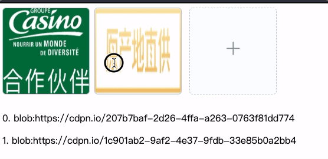

# el-upload-sortable
Element UI 照片墙增加拖动调整顺序功能

[TypeScript版](#typescript)

## 链接
- [Demo](https://codepen.io/anon/pen/Pvqgzo)



## 安装
`npm i -S el-upload-sortable`

## 使用

```typescript
import ElUploadSortable from "el-upload-sortable";

export default {
  components: {
    ElUploadSortable
  },
  methods: {
    picUpdate(list){
      // this.myList = list
    }
  }
}
```

```html
<template>
  <el-upload-sortable @change="picUpdate"></el-upload-sortable>
</template>
```

### TypeScript
如果你是使用TypeScript，请直接拷贝`node_modules/el-upload-sortable/src/index.ts.vue`到你自己的组件目录进行开发。

**你需要自行处理**
- tsconfig.json
- 安装vue-property-decorator

```javascript
import { Component, Vue } from "vue-property-decorator";
import ElUploadSortable from "../../../node_modules/el-upload-sortable/src/index.ts.vue"; // 这里的路径结合实际情况

@Component({
  components: {
    ElUploadSortable
  }
})
```

## Props

属性 | 说明 | 类型 | 默认值
---- | --- | --- | ---
max | 最多可以上传图片数量 | number | 15
action | 上传图片的api地址 | string | https://jsonplaceholder.typicode.com/posts/
list | 初始图片列表（可选） | array | []
multiple | 是否多选（可选） | boolean | false
param | 上传接口返回结果中图片链接对应的字段（可选），若接口返回结果为{url: 'xxx'}，则传值为"url"，若接口返回结果为{result:{url:'xxx'}}，则传值应为"result.url"，依此类推 | string | ""

## Events

属性 | 说明 | 回调参数
---- | --- | --- 
change | 照片墙数据更新时的事件 | （imageList） 
